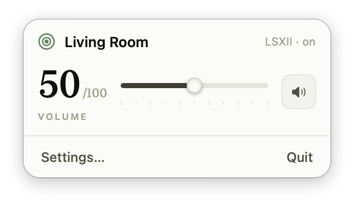
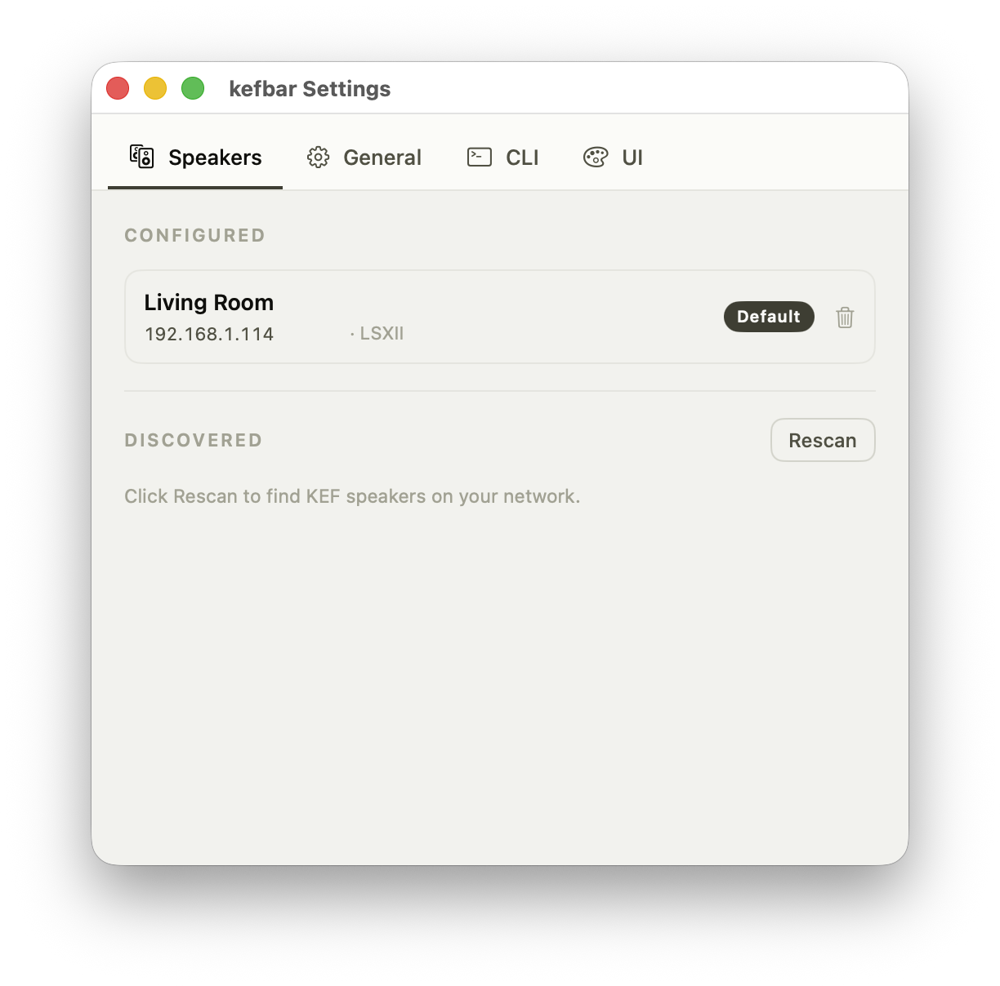
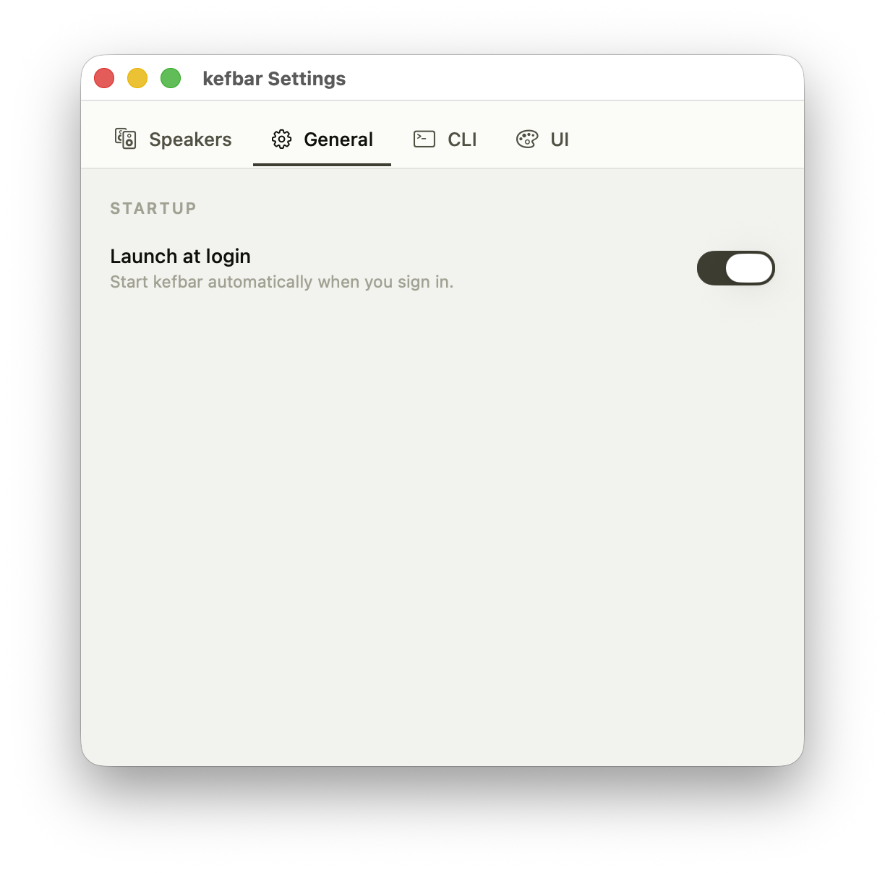
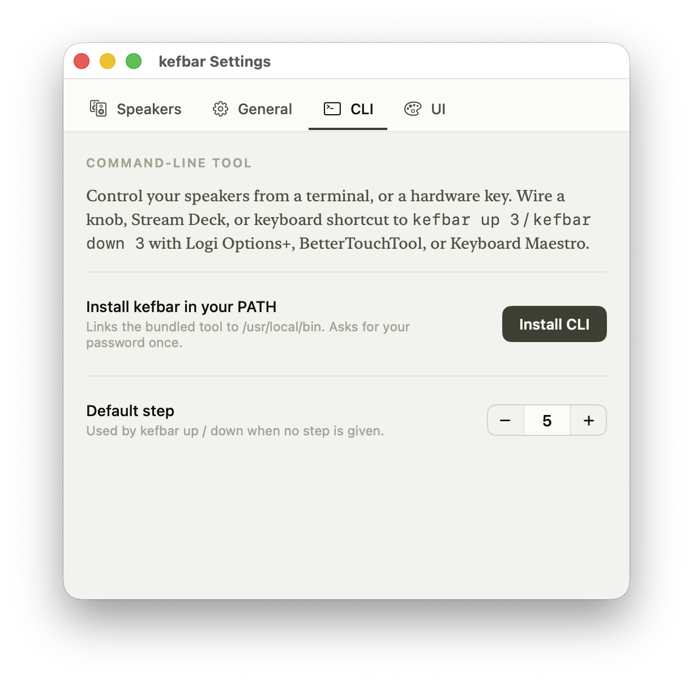
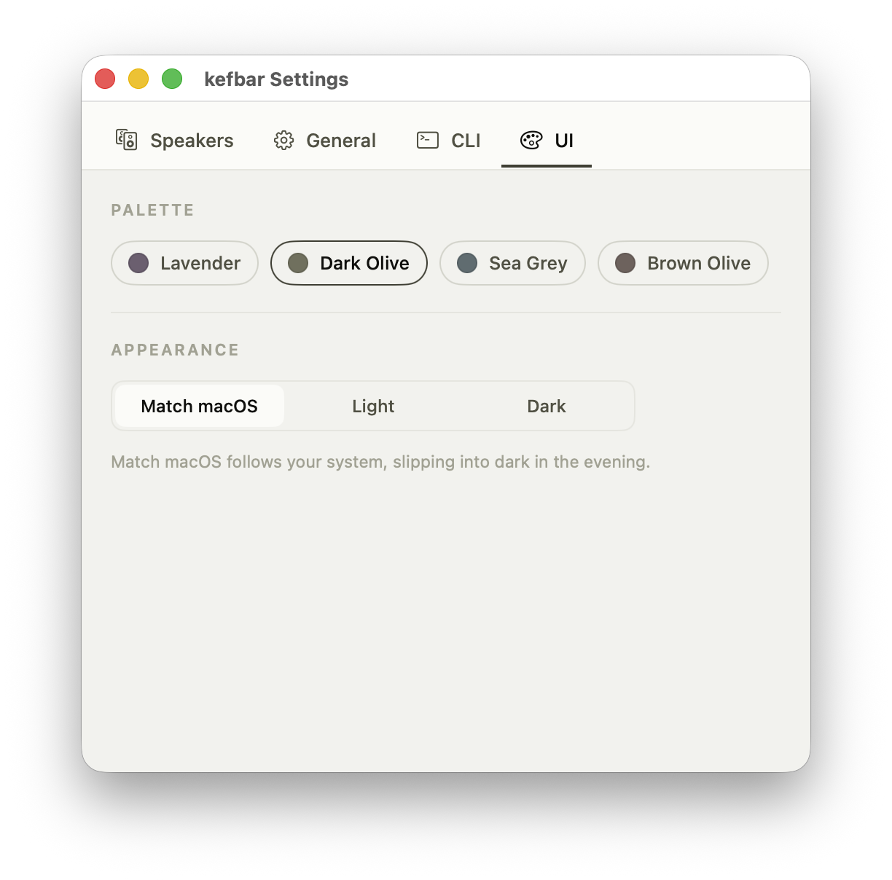
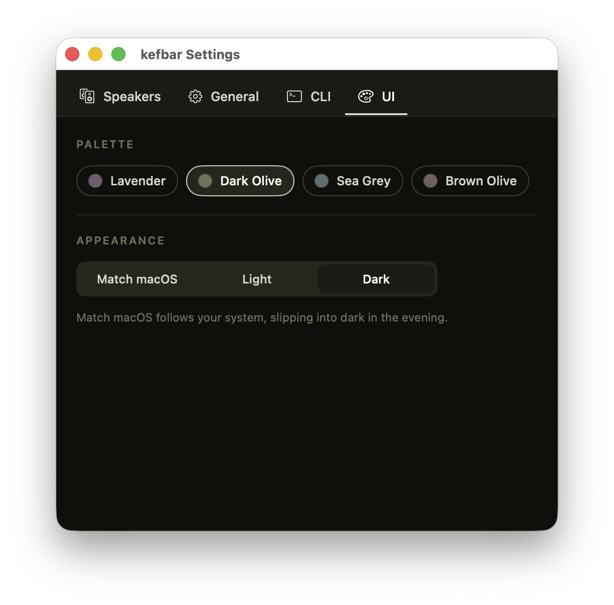

<!-- SPDX-License-Identifier: GPL-3.0-or-later -->
# kefbar

A tiny, open-source macOS app + CLI to control the volume of **KEF W2-platform**
wireless speakers (LSX II, LSX II LT, LS50 Wireless II, LS60 Wireless) from the
menu bar and the command line. No cloud, no KEF Connect app, no remote — just the
speaker's own local HTTP API on your LAN.

<p align="center">
  
</p>

See [`SPEC.md`](SPEC.md) for the full design.

<details>
<summary><b>Settings screenshots</b> (Speakers, General, CLI, Appearance)</summary>

<br>

**Speakers** - configured speakers are keyed by MAC, and Rescan finds KEF speakers on your LAN.



**General** - launch kefbar automatically when you sign in.



**CLI** - install the bundled `kefbar` tool into your PATH and set the default volume step for `up` / `down`.



**Appearance** - four palettes (Lavender, Dark Olive, Sea Grey, Brown Olive) plus Match macOS, Light, or Dark. Shown here in both light and dark:

| Light | Dark |
|:---:|:---:|
|  |  |

</details>

## Status

| Milestone | Scope | State |
|-----------|-------|-------|
| **M0** | `KEFKit` library (HTTP client, config, mock server) | ✅ done |
| **M1** | `kefbar` CLI (get/set/up/down/mute/unmute/status/list) | ✅ done |
| **M2** | Bonjour + subnet discovery (`kefbar discover`) | ✅ done |
| **M3** | Menu-bar app (`MenuBarExtra`, live sliders) | ✅ done |
| M4 | DMG packaging, embedded CLI, notarize | ⏳ next |

The API paths, write method (POST), model/firmware source (`settings:/releasetext`),
and Bonjour service types were verified against a live LSX II before implementation.

## Requirements

- macOS 13 (Ventura) or later
- Xcode / Swift toolchain (Swift 5.9+)

## Build

```sh
make release          # optimised build -> .build/release/kefbar
make test             # run unit tests
make install          # copy the CLI into /usr/local/bin (may prompt for sudo)
```

Or directly: `swift build -c release`, `swift test`.

## CLI usage

```
kefbar get                     # current volume (0-100)
kefbar set 30                  # absolute volume (clamped to the speaker's maxVolume)
kefbar up   [step]             # relative; step defaults to cliStep (5), max 10
kefbar down [step]
kefbar mute                    # volume 0, remembers the prior level
kefbar unmute                  # restore the pre-mute level
kefbar status                  # model, name, power, volume, firmware
kefbar list                    # configured speakers (default marked with *)
```

Flags: `--speaker <name>` · `--host <ip>` · `--step <n>` · `--json`

**Speaker selection:** `--host` wins; else `--speaker <name>`; else the configured
default; else the sole configured speaker; else an error asking you to choose.

**Exit codes:** `0` success · `2` usage/resolution · `3` unreachable ·
`4` firmware too old (write unsupported). Old-firmware writes still succeed via a
legacy path and print a one-line warning to stderr (exit stays `0`).

```sh
kefbar --host 192.168.1.114 set 25
kefbar --host 192.168.1.114 up 3
kefbar --speaker "Living Room" get --json      # -> {"volume":25}
```

### ⚠️ macOS Local Network permission (macOS 15+)

Reaching a speaker on your LAN requires **Local Network** permission (System
Settings → Privacy & Security → Local Network). The first time you run `kefbar`
from Terminal, macOS prompts once — click **Allow**. When a launcher app (Logi
Options+, Stream Deck, BetterTouchTool, Keyboard Maestro) runs `kefbar`, grant
**that app** Local Network access. The menu-bar app (M3) will request this
automatically. Without it you'll see `network error … offline` even though the
speaker is reachable.

## Hardware buttons

The CLI is the integration surface. Examples:

- **Logi Options+** → launch a `.command` file containing `kefbar up 3`.
- **Stream Deck / BetterTouchTool / Keyboard Maestro** → run a shell command:
  `/usr/local/bin/kefbar up 3` (or `down 3`, `mute`, …).

Rapid taps are safe: relative `up`/`down` serialise through an `flock` lockfile, so
five quick `kefbar up` presses sum correctly instead of racing.

## Configuration

Shared by the app and CLI at
`~/Library/Application Support/kefbar/config.json` (the app writes it; the CLI only
reads it). Speakers are keyed by MAC so a DHCP address change self-heals.

```jsonc
{
  "version": 1,
  "defaultSpeakerId": "84:17:15:03:CD:9E",
  "cliStep": 5,
  "speakers": [
    {
      "id": "84:17:15:03:CD:9E",
      "name": "Living Room",
      "host": "192.168.1.114",
      "model": "LSXII",
      "maxVolume": 100,
      "firmware": "V30137"
    }
  ]
}
```

Run `kefbar discover` to find speakers on the LAN (it prints them and does **not**
modify config); add them by hand or via the app, or drive the CLI directly with `--host`.

## Testing without hardware

```sh
make mock          # mock KEF speaker on 127.0.0.1:8080
kefbar --host 127.0.0.1:8080 status
make mock-legacy   # simulate old GET-only firmware (exercises the fallback warning)
```

## License

GPL-3.0-or-later. See [`LICENSE`](LICENSE).
